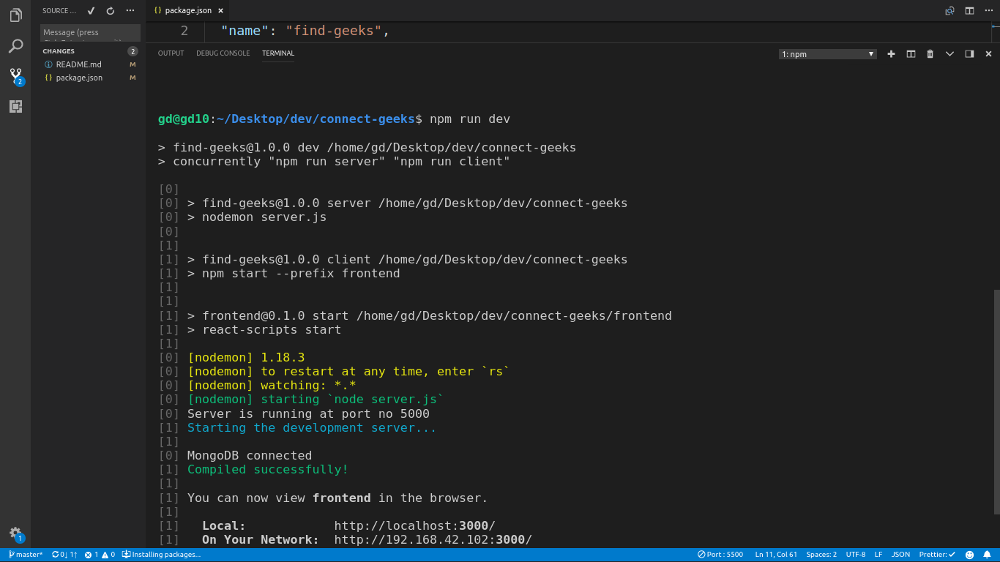
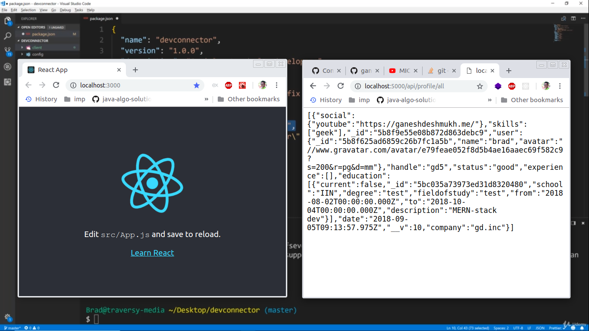
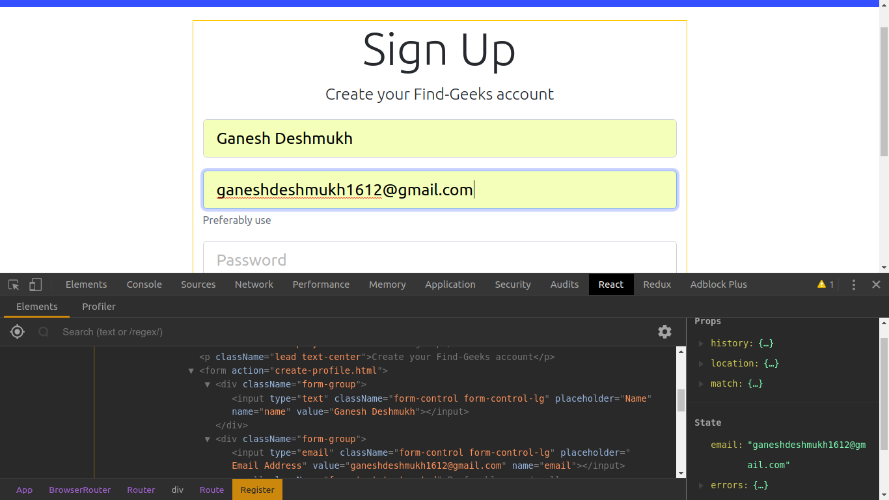
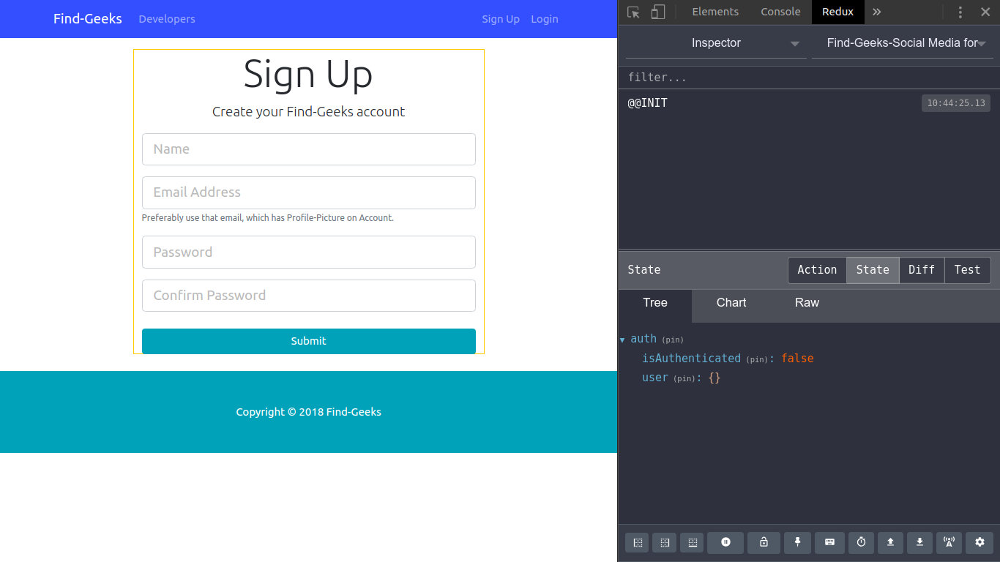

# connect-geeks

#steps I took to build complete project

1.npm init

2.installed required modules

3.installed dev-dependencies. e.g. nodemon(which is used only during development phase)

4.setup of 'script-tool' to copy output of terminal in steps.txt file.

5.basic express setup.

by importing express,calling express by variable app, app.get, listening to request at port.

6.configured database with URI and DB credentials

7.finished setup of Express routes for post, profiles and users

8.create router as 'const router = express.Router();
|-> don't forget parenthesis, otherwise it throws error of "TypeError: Cannot read property 'push' of undefined"

9.create models for each route eg.for user(auth0) and profile(all details of user).

10.Model name convention is same as classes in Java- start with Capital letter and singular.

11.Added route for registration.

12.Add bodyparser to accept data from front-end.

13.Add avator from npm-gravator.

14.store password in encrypted form using "genSalt()" for round of salts value=10;

15.then create hash using that salt.

16.If 'unhandled error: listen EADDR_IN_USE:::5000' occurs then run 'killall node'

17.create model of Profile to save details of Profile

18.create current user profile route

19.Update profile routes creation

20.validate profile details,eg. handle

21.added route 'profile/experience' in 'api/profile.js'

22.added 'experience-validator' file for exp-details validatin

23.added 'delete-experience' route for profile.

24.created model for storing posts, as 'api/profile/posts'

25.added validation to user's post-field.

26.added route to see all posts by get rqst to 'api/posts'

27.added route to like post by its id.

28.added route '/api/posts/comment/:id' to comment on posts.

29.completed backend and added route to delete comments in post

30.completed front-end theme using Bootstrap-4.0

31.create-react-app `frontend`, to create client-side in ReactJS.
which runs on port 3000.

32.added command `npm-install` to install front-end/client dependencies in `frontend-directory`.

`--prefix` option allows us to implicitly go to mentioned directory as `cd frontend` internally.

`"client-install": "npm install --prefix frontend"`

33.added npm module `concurrently` which allows to run simmultaneously both servers,

client and backend using single command,

`"dev": "concurrently \"npm run server\" \"npm run cliend\""`

34.added React-Components. Navbar-smart component, Header & Footer are Dumb components.

35.added Landing-page Component.

installed `react-router-dom`(v4), previously it was just `react-router`.

36.added routing for Login, SignUp, path='/' using `BrowserRouter` and added pages for respective route.

37.Accepting input through register-form, by changing state from initial to new state using `setState()`.

initial-state is empty, after typing state changes.

38.installed `axios-library` in frontend directory, to make request to backend.

alternative is `fetch-API`, but it's better to use axios, same as postman-but without UI.

39.made request to database, where db is fresh and new, without old values.

40.Installed `npm-package-classnames`, for adding classes dynamically to bootstrap-form-validation

41.We won't make requests from react-forms, rather we would use Redux-actions,
response to be sent through reducer.

42.Though our application is not Huge, like Facebook, we actually don't need Redux,

but, to share data between components and need Application-Level state,
preserving Component-level state also.

42.We will have states as authentication, user, profile, post, errors-reducers.

43.Basic Redux flow is UI-> Action-> Reducer-> Single-Store-> Loop-UI.

44.Provider is wrapper to wrap all React-Components.

Redux-Thunk - ajax request asynchronous through thunk.

45.Installed modules `react-redux, redux-thunk, redux` in `frontend` directory, not in root directory.

46.adding reducers, which takes old-actions and returns new action to store, to make changes in store.

47.setup of Redux-dev-tools - chrome-extension for debugging redux-code.

48.creating actions for users, reducers and dispatching actions.

fetching data from backend asynchronously, so use `thunk-middleware`.
